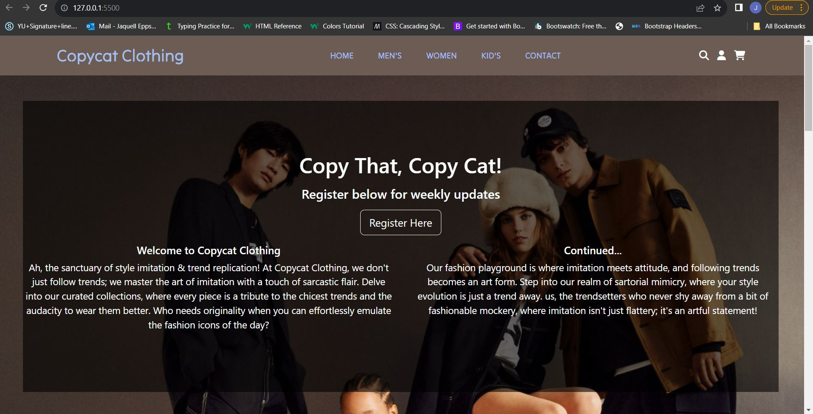
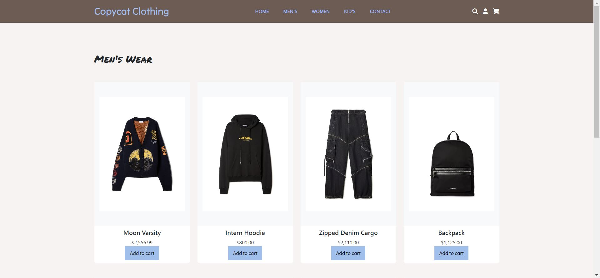
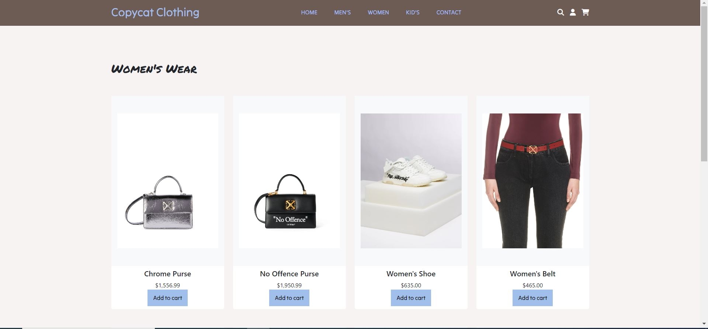
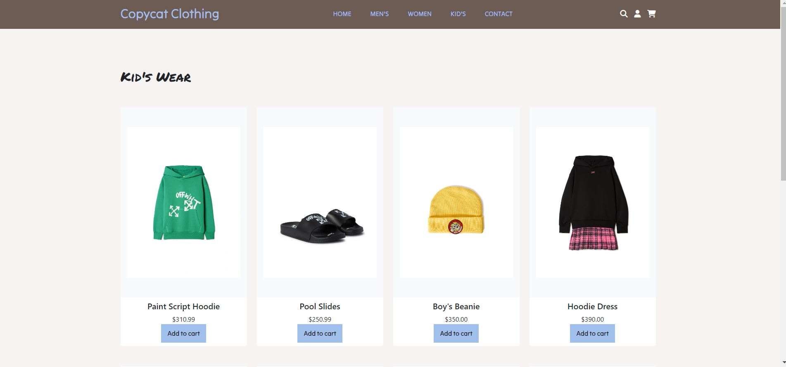
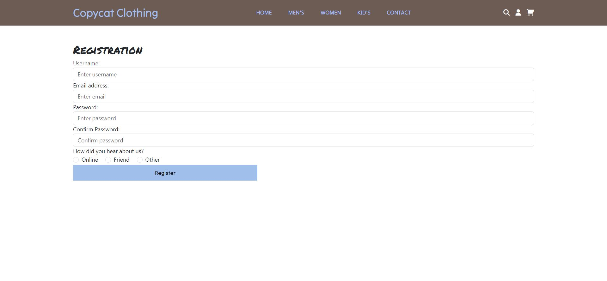
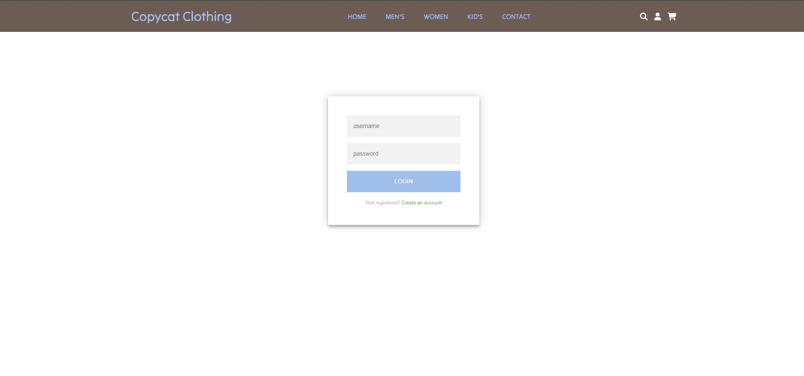
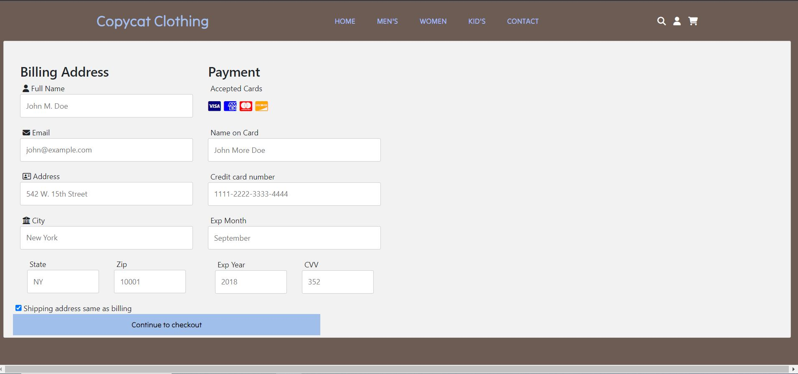

# capstone1

# Copycat Clothing Website

Copycat Clothing is an e-commerce website selling clothing items for men, women, and kids.

## Table of Contents

- [Features](#features)
- [Installation](#installation)
- [Usage](#usage)
- [Contributing](#contributing)
- [License](#license)

## Features

- User-friendly interface for browsing and purchasing clothing items.
- Separate sections for men, women, and kids, making it easy for users to find specific items.
- Secure checkout process with payment options and shipping address confirmation.

## Installation

To install Copycat Clothing on your local machine, follow these steps:

1. Clone the repository: `git clone https://github.com/jaquellsensi/capstone1.git`
2. Navigate to the project directory: `cd capstone1`
3. Install dependencies: `npm install`

## Usage

To run the Copycat Clothing website locally, use the following command:

npm start

http://127.0.0.1:5500/index.html

### Home Page

### Men's Page

### Women's Page

### Kid's Page

### Register Page

### Sign In Page

### Checkout Page
